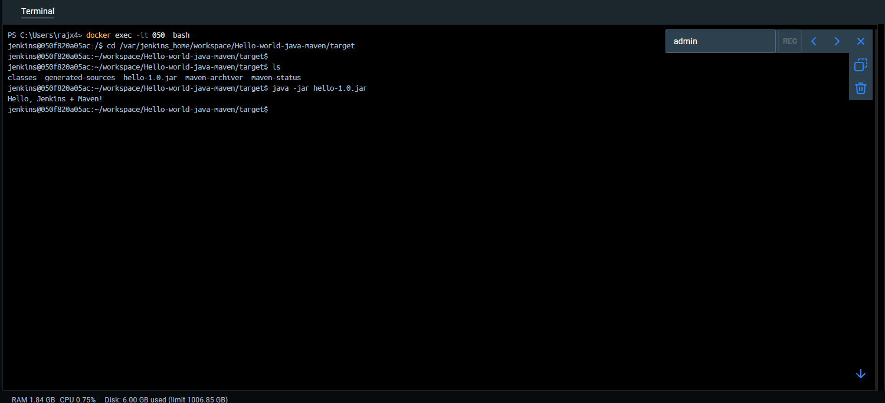

# 🚀 Hello World Java Maven - CI/CD using Jenkins

This project demonstrates a simple Java application built using Maven and integrated with Jenkins for continuous integration and deployment.

---

## 🧰 Tech Stack

- **Java 8**: Programming language.
- **Maven**: Build automation tool.
- **Jenkins**: CI/CD automation server.
- **Docker**: Containerization platform.

---

## 🛠️ Jenkins CI/CD Pipeline

### 🔁 Workflow Overview

1. **Code Checkout**: Jenkins pulls the latest code from GitHub.
2. **Build**: Jenkins builds the project using Maven:
    ```bash
    mvn clean package
    ```
3. **Artifact Generation**: A `.jar` file is created in the `target/` directory.
4. **Execution**: The generated `hello-1.0.jar` can be executed with:
    ```bash
    java -jar hello-1.0.jar
    ```

---

### ✅ Maven Configuration (`pom.xml`)

The `pom.xml` file is configured to package the application as a JAR and specify the main class:

```xml
<project xmlns="http://maven.apache.org/POM/4.0.0" ... >
  <modelVersion>4.0.0</modelVersion>
  <groupId>com.example</groupId>
  <artifactId>hello</artifactId>
  <version>1.0</version>
  <packaging>jar</packaging>

  <build>
     <plugins>
        <plugin>
          <groupId>org.apache.maven.plugins</groupId>
          <artifactId>maven-jar-plugin</artifactId>
          <version>3.2.0</version>
          <configuration>
             <archive>
                <manifest>
                  <mainClass>HelloWorld</mainClass>
                </manifest>
             </archive>
          </configuration>
        </plugin>
     </plugins>
  </build>
</project>
```

---

### 📂 Directory Structure (Post-Build)

```
.
├── pom.xml
├── src
│   └── main
│       └── java
│           └── HelloWorld.java
└── target
     └── hello-1.0.jar
```

---

## 📸 Screenshots

### 1️⃣ Jenkins Job Configuration


### 2️⃣ Successful Build Console Output


### 3️⃣ Application Output
Output of running the JAR file:


---
